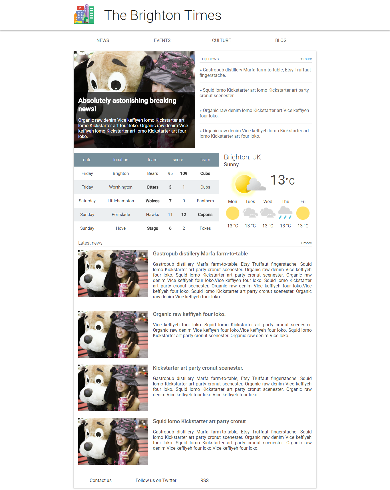
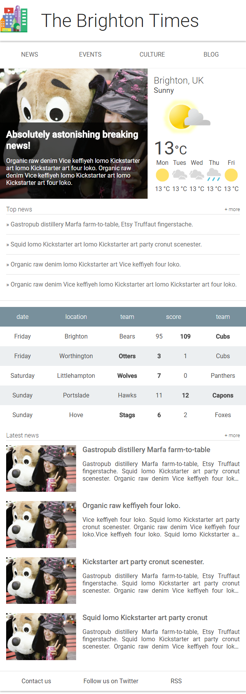
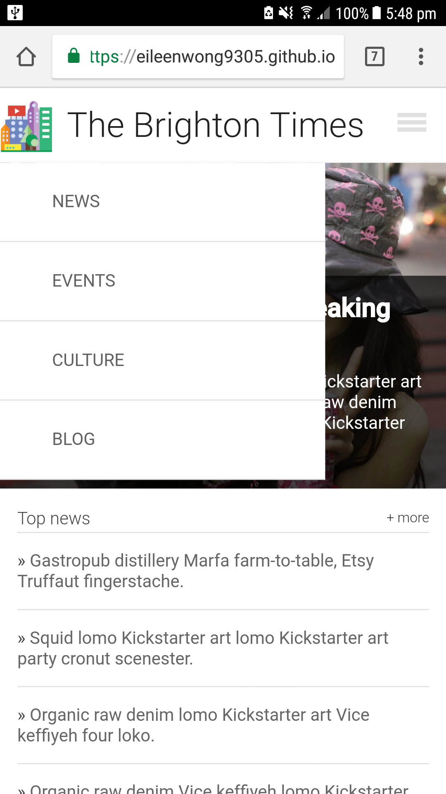

# Brighton Times Website
by Eileen Wong

## Table of Contents
* [Project Background](#project-background)
* [Project Content](#project-content)
* [Demo](#demo)
* [How to Load](#how-to-load)
* [Project Display Screenshot](#project-display-screenshot)
* [Bugs and Feature Requests](#bugs-and-feature-requests)
* [Resources Used](#resources-used)
* [Skill Demonstrated](#skill-demonstrated)

## Project Background
This project creates a responsive webpage that display the main page of hometown website. For more detailed description and instruction, please visit [Udacity Classroom](https://classroom.udacity.com/courses/ud893/).

## Project Content
This project contains following files:
- index.html
- main.css:
- responsive.css
- images file: containing image in webpage
- README.md: explanation of the project

## Demo
Check out final product [here](https://eileenwong9305.github.io/Brighton-Times/).

## How to Load
1. Download the project zip file to your pc and unzip the file. Or clone the repo to your pc.
2. Open the index.html in your preferred browser.

## Project Display Screenshot
Full screen view of the webpage

    

Half screen view of webpage

    

Phone screen view of webpage

    

Expandable navigation drawer

    

## Bugs and Feature Requests
If there is a bug or feature request, please open an [issue](https://github.com/eileenwong9305/movie-trailer-website/issues/new).

## Resources Used
### Multiline truncation with ellipsis:
- <http://hackingui.com/front-end/a-pure-css-solution-for-multiline-text-truncation/>

## Skill Demonstrated
- Used responsive pattern (mostly fluid, layout shifter and off canvas)
- Created navigation bar responsive to the size of the viewport.
- Optimized the table, font and image for responsive layout.
